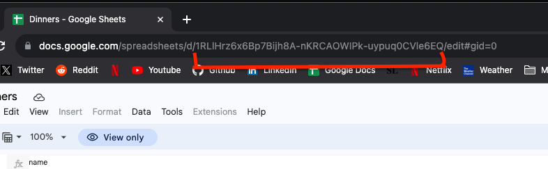
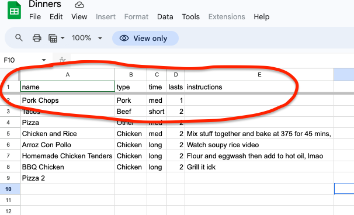

# Sheets-cms

This repo connects Google Sheet data to an Astro website using [opensheet](https://github.com/benborgers/opensheet).

To get started, clone fork or download this repo and run `npm install` in the directory to install dependencies.

To build the project run locally `npm run dev` and open [localhost:4321](http://localhost:4321) in your browser.

For further info and documentation on Astro, check out the [Astro docs](https://docs.astro.build/).

## Finding the sheet id

The sheet ID is the long string of characters in the URL of your Google Sheet.



## Note: You need headers

Note that you will need headers in your sheet for the data to render properly. Drag the first row down to the second row to create headers.



## 📝 Editing content

The content on the index page is rendered via the `src/Sheets.astro` component. Edit the `response` URL like so:

```astro
"https://opensheet.elk.sh/[GOOGLESHEET-ID-HERE]/1"
```
